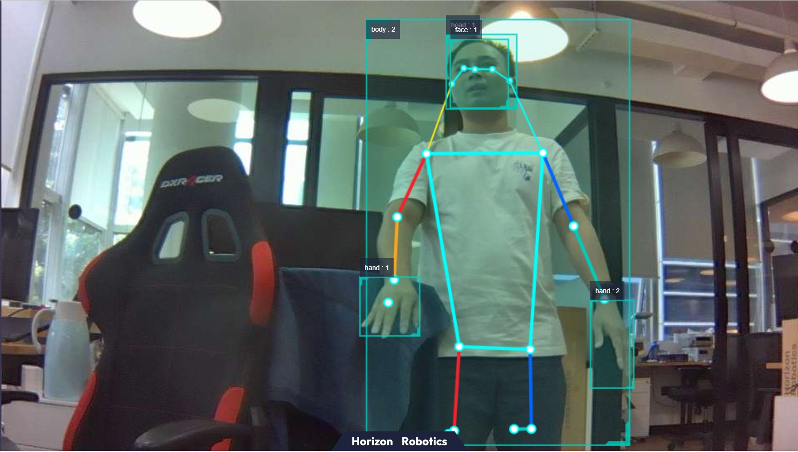

English| [简体中文](./README_cn.md)

# Function Introduction

The mono2d_body_detection package is an example of single RGB human body detection algorithm developed using the hobot_dnn package. It uses models and image data on the Horizon X3 development board to perform model inference using the BPU processor.
The detection model is faster R-CNN, and the model output includes human body, human head, human face, human hand bounding boxes, and human body keypoint detection results.

The example subscribes to image data image msg and publishes custom perception results hobot ai msg. Users can subscribe to the published ai msg for application development.


# Bill of Materials

| Material Name        | Manufacturer | Reference Link                                               |
| :------------------- | ------------ | ------------------------------------------------------------ |
| RDK X3 / RDK Ultra    | Multiple Manufacturers | [RDK X3](https://developer.horizon.cc/rdkx3)<br>[RDK Ultra](https://developer.horizon.cc/rdkultra) |
| Camera              | Multiple Manufacturers | [MIPI Camera](https://developer.horizon.cc/nodehubdetail/168958376283445781)<br>[USB Camera](https://developer.horizon.cc/nodehubdetail/168958376283445777)|


# Preparation

- Horizon RDK comes with pre-burned Ubuntu 20.04 system image.
- Camera is correctly connected to RDK X3.

# Instructions

**1. Install package**

After booting up the robot, connect to the robot via SSH terminal or VNC. Click the "One-Click Deployment" button on the top right of this page, copy and run the following commands in the RDK system to install the necessary Nodes.

tros foxy:
```bash
sudo apt update
sudo apt install -y tros-mono2d-body-detection
```

tros humble:
```bash
sudo apt update
sudo apt install -y ros-humble-ros-base
sudo apt install -y tros-humble-mono2d-body-detection
```

**2. Run Human Body Detection**

**Publishing Images Using MIPI Camera**

tros foxy:
```shell
# Set up tros.b environment
source /opt/tros/setup.bash

# Copy configuration files required for running the example from the installation path of tros.b.
cp -r /opt/tros/${TROS_DISTRO}/lib/mono2d_body_detection/config/ .

# Configure MIPI camera
export CAM_TYPE=mipi

# Launch the launch file
ros2 launch mono2d_body_detection mono2d_body_detection.launch.py

```

tros humble:
```shell
# Set up tros.b humble environment
source /opt/tros/humble/setup.bash

# Copy configuration files required for running the example from the installation path of tros.b.
cp -r /opt/tros/${TROS_DISTRO}/lib/mono2d_body_detection/config/ .

# Configure MIPI camera
export CAM_TYPE=mipi

# Launch the launch file
ros2 launch mono2d_body_detection mono2d_body_detection.launch.py

```

**Publishing Images Using a USB Camera**

tros foxy:
```shell
# Configure the tros.b environment
source /opt/tros/setup.bash

# Copy the configuration files required to run the example from the installation path of tros.b.
cp -r /opt/tros/${TROS_DISTRO}/lib/mono2d_body_detection/config/ .

# Configure the USB camera
export CAM_TYPE=usb

# Launch the launch file
ros2 launch mono2d_body_detection mono2d_body_detection.launch.py
```

tros humble:
```shell
# Configure the tros.b humble environment
source /opt/tros/humble/setup.bash

# Copy the configuration files required to run the example from the installation path of tros.b.
cp -r /opt/tros/${TROS_DISTRO}/lib/mono2d_body_detection/config/ .

# Configure the USB camera
export CAM_TYPE=usb

# Launch the launch file
ros2 launch mono2d_body_detection mono2d_body_detection.launch.py
```

**3. Checking the Effects**

Open a browser on a computer in the same network, visit [http://IP:8000](http://IP:8000) to see real-time visual recognition effects, where IP is the RDK's IP address:


# Interface Description

## Topics

All body recognition results are published through the topic [hobot_msgs/ai_msgs/msg/PerceptionTargets](https://github.com/HorizonRDK/hobot_msgs/blob/develop/ai_msgs/msg/PerceptionTargets.msg), whose detailed definition is as follows:
```shell
# Perception Results

# Message Header
std_msgs/Header header

# Framerate of perception results
# fps val is invalid if fps is less than 0
int16 fps

# Performance statistics, such as recording the time consumption of each model inference
Perf[] perfs

# Collection of perception targets
Target[] targets

# Collection of disappeared targets
Target[] disappeared_targets
```


| Name                 | Message Type        | Description|
| ---------------------- | ----------- |---------------------------- |
| /hobot_mono2d_body_detection | [hobot_msgs/ai_msgs/msg/PerceptionTargets](https://github.com/HorizonRDK/hobot_msgs/blob/develop/ai_msgs/msg/PerceptionTargets.msg) | Publish information about recognized human body targets |
| /hbmem_img | [hobot_msgs/hbm_img_msgs/msg/HbmMsg1080P](https://github.com/HorizonRDK/hobot_msgs/blob/develop/hbm_img_msgs/msg/HbmMsg1080P.msg) | Subscribe to image data published by the previous node using shared memory communication when is_shared_mem_sub == 1 |
| /image_raw | hsensor_msgs/msg/Image | Subscribe to relevant image data published by the previous node using standard ROS subscription method when is_shared_mem_sub == 0 |


## Parameters

| Parameter Name         | Type        | Description                                                                                                                          | Required | Supported Configurations              | Default Value                                         |
| ----------------------  | ----------- | ------------------------------------------------------------------------------------------------------------------------------------- | -------- | ----------------------------------- | ---------------------------------------------------- |
| is_sync_mode            | int         | Synchronous/asynchronous inference mode. 0: asynchronous mode; 1: synchronous mode                                                     | No       | 0/1                                  | 0                                                    |
| model_file_name         | std::string | Model file used for inference                                                                                                        | No       | Configured based on actual model path | config/multitask_body_head_face_hand_kps_960x544.hbm  |
| is_shared_mem_sub       | int         | Whether to subscribe to image messages using shared memory communication. 0: off; 1: on. Topic names for subscribing with and without shared memory communication are /hbmem_img and /image_raw respectively. | No       | 0/1                                  | 1                                                    |
| ai_msg_pub_topic_name   | std::string | Topic name for publishing AI messages containing perception results of human body, head, face, hand bounding boxes, and keypoints | No       | Configured based on deployment environment | /hobot_mono2d_body_detection                         |
| ros_img_topic_name      | std::string | ROS image topic name | No       | Configured based on deployment environment | /image_raw                         |
| image_gap               | int         | Frame skipping interval, indicating the frequency at which images are processed by the algorithm. 1 processes every frame, 2 processes every two frames, and so on. | No       | Configured based on deployment environment | 1                         |
